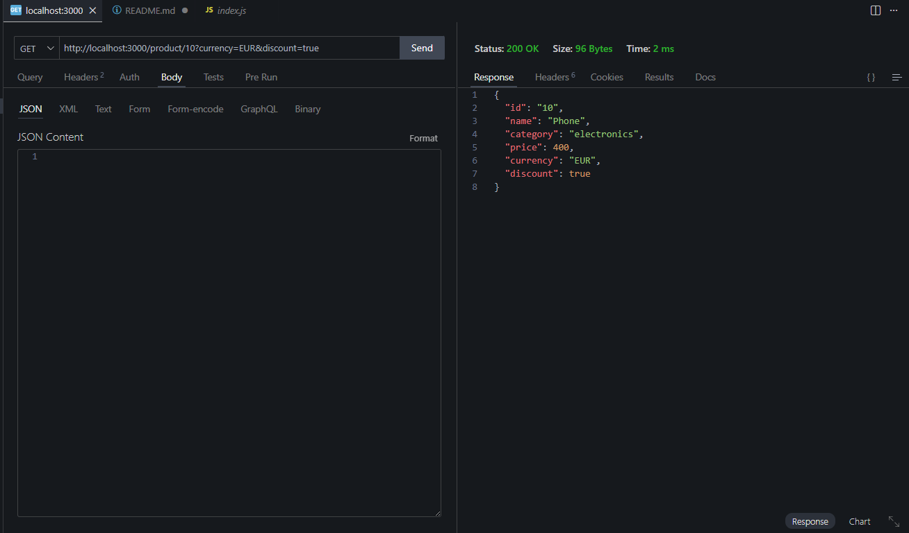

# Mini Backend API

A small Node.js + Express backend project to practice:
- route params
- query params
- JSON responses
- basic filtering

---

## 🚀 Features

- `GET /profile/:id` – user profile with optional `lang` and `details` query params  
- `GET /product/:id` – product info with optional `currency` and `discount`  
- `GET /products` – list products with optional `category` and `maxPrice` filters  
- 404 handler for unknown routes

---

## 📸 Screenshots





---

## 🛠 How to Run

```bash
git clone https://github.com/QunnorQuarantine/backend.git
cd backend/mini-backend-api
npm install
node index.js
